<div align="center">


# समीक्षा · Samiksha

**AI-enabled capacity building for India's Official Statistical System**

Smart India Hackathon 2026 · Problem Statement **SIH26101** · Ministry of Statistics & Programme Implementation

[](https://github.com/adryxportfolio/sih2026/actions/workflows/release.yml)
[](https://github.com/adryxportfolio/sih2026/releases/latest)
[](docs/Samiksha-Technical-Documentation.pdf)
[](docs/Samiksha-Presentation.pptx)

<br/>

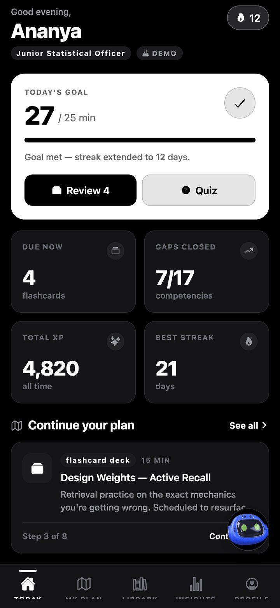
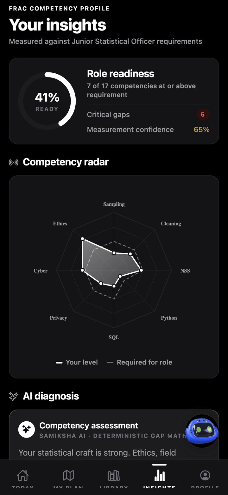
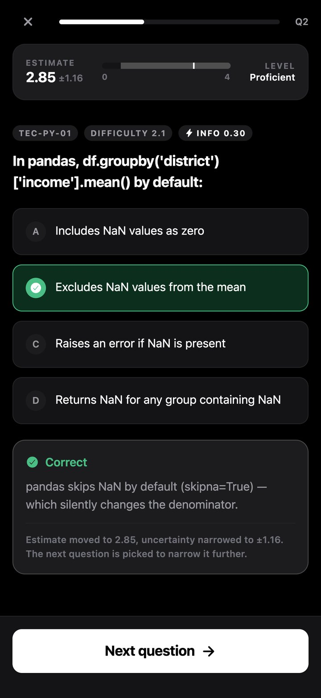
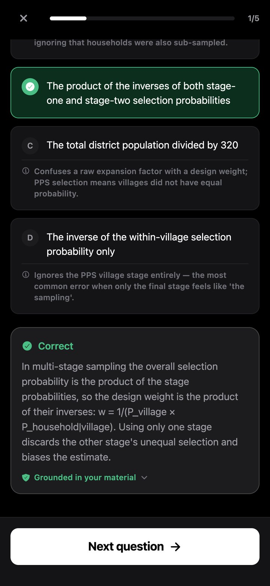
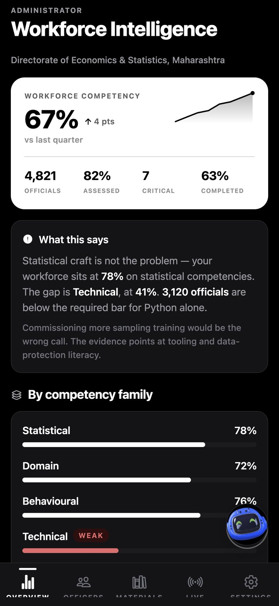

</div>

---

Samiksha measures every statistical officer against the competencies their post requires, teaches exactly what is missing — through iGOT Karmayogi courses and grounded practice generated from department material — and gives them AI agents for the repetitive analytical work, **while recording what they delegate as evidence about their skills**.

| 📄 Read | 🎞 Present | 📱 Install |
|---|---|---|
| [**Technical Documentation (PDF, 52 pages)**](docs/Samiksha-Technical-Documentation.pdf) — problem, solution, architecture, AI design, algorithms, data model, security, operations, FAQ | [**Presentation (PPTX, 10 slides)**](docs/Samiksha-Presentation.pptx) · [PDF](docs/Samiksha-Presentation.pdf) — with speaker notes | [**Latest release**](https://github.com/adryxportfolio/sih2026/releases/latest) — Officer, Admin and two no-account Demo APKs, plus the Windows Workspace installer |

---

## Contents

- [The problem](#the-problem)
- [The solution](#the-solution)
- [How it works](#how-it-works)
- [Features](#features)
- [Architecture](#architecture)
- [AI design and model choice](#ai-design-and-model-choice)
- [Algorithms and learning science](#algorithms-and-learning-science)
- [Security and governance](#security-and-governance)
- [Getting started](#getting-started)
- [Repository layout](#repository-layout)
- [What has been built, and why](#what-has-been-built-and-why)
- [Limitations and roadmap](#limitations-and-roadmap)

---

## The problem

> *Develop an AI enabled learning platform that identifies competency gaps, recommends personalized training through integration with the iGOT Karmayogi ecosystem, and capable of generating Quizzes and Multiple choice questions (MCQs) from uploaded learning materials to strengthen capacity building in India's Official Statistical System.*

Thousands of officers across MoSPI, the NSO, NSSTA and every state Directorate of Economics & Statistics produce the figures behind budgets, monetary policy and welfare programmes. The skills that job needs are shifting — Python, SQL, GIS and the DPDP Act now sit alongside sampling and estimation — while capacity building still relies on:

| Today | Consequence |
|---|---|
| Self-reported training needs | People misjudge their own skill; training goes to the wrong people and topics |
| Generic course catalogues | No order, no link to an individual gap, courses taken before their prerequisites |
| Hand-written MCQs | Few assessments; handbooks and circulars read once and forgotten |
| Enrolment dashboards | Administrators cannot see where a directorate is collectively weak |
| AI tools that just do the work | Productivity rises, capability does not, and dependency stays invisible |

The statement hides **two AI engines** (skill intelligence and an assessment engine) and **two audiences** (learners and administrators). Building only one half gives you a quiz generator or a dashboard.

## The solution

Two halves that feed each other — and the connection is the point.

```
        LEARN · mobile app                              DO · AI Workspace
  ┌──────────────────────────────┐              ┌──────────────────────────────┐
  │ Role → FRAC requirements     │  measured    │ Data Quality agent           │
  │ Adaptive test, quizzes       │  gaps  ────▶ │ Data Analyst agent           │
  │ SQL gap arithmetic           │  (prompt)    │ Report Assistant agent       │
  │ Prerequisite-aware plan      │              │ Browser · terminal · files   │
  │ Practice from material       │ ◀────  work  │ Same sign-in as the app      │
  │ Misconceptions, calibration  │  delegated   │ Every run ends at a draft    │
  └──────────────────────────────┘ (evidence)   └──────────────────────────────┘
                     "What you are handing to your agents"
```

- **Learning** measures each officer against the FRAC competencies their post requires, and teaches what is missing.
- **The Workspace** gives them AI agents to delegate repetitive analytical work to.
- **The loop** joins them. Agents are told where the officer is weak and explain the step that matters while they work. Every delegation is recorded against a competency, so repeatedly handing over Python work becomes evidence that a measured gap is costing real autonomy.

### Four products, one platform

| Product | Runs on | For |
|---|---|---|
| **Samiksha** | Android · web | Officers: profile, adaptive diagnostic, personalised plan, department material, AI practice, spaced review, Samiksha AI, Workspace |
| **Samiksha Admin** | Android · web | Administrators and nodal officers: workforce intelligence, roster and records, live board, publishing, provisioning, Samiksha AI operator |
| **Samiksha Demo / Admin Demo** | Android | Both journeys over a seeded dataset — no account, works offline |
| **Samiksha Workspace** | Windows desktop · web | Persistent AI agents with their own computers, competency-aware, same credentials |

---

## How it works

### The officer

<table>
<tr>
<td width="20%">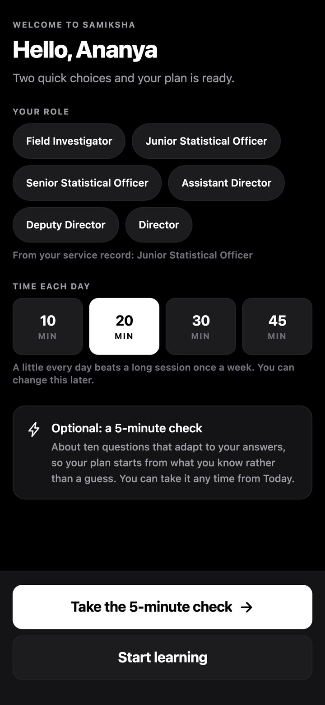</td>
<td width="20%"></td>
<td width="20%">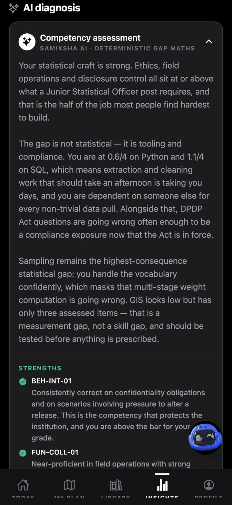</td>
<td width="20%">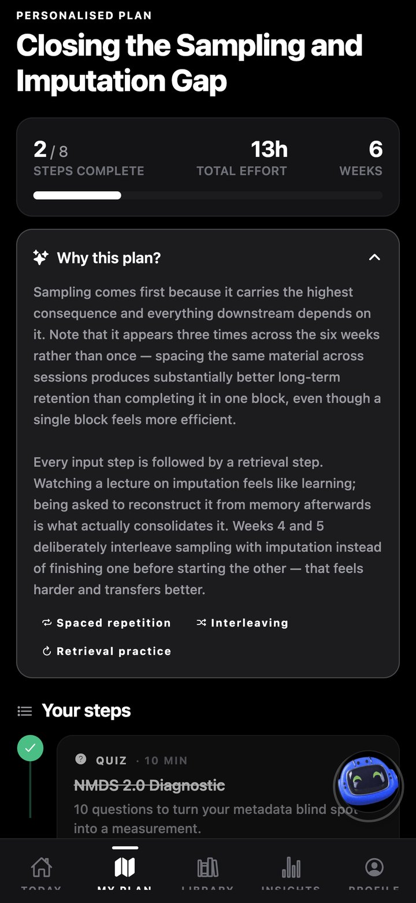</td>
<td width="20%">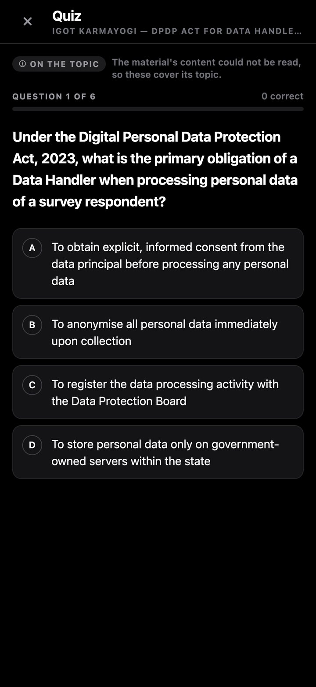</td>
</tr>
<tr>
<td><b>1 · Onboard</b><br/><sub>Account provisioned against an employee ID. Confirm role and daily goal — two taps.</sub></td>
<td><b>2 · Measure</b><br/><sub>IRT adaptive test picks the most informative question; the uncertainty band narrows live.</sub></td>
<td><b>3 · Understand</b><br/><sub>Gaps computed in SQL against the post; Samiksha AI explains them in plain language.</sub></td>
<td><b>4 · Plan</b><br/><sub>iGOT courses sequenced by prerequisites and learning science, each step with a reason.</sub></td>
<td><b>5 · Practise</b><br/><sub>Quiz, flashcards or mock test written from the material the department assigned.</sub></td>
</tr>
<tr>
<td></td>
<td>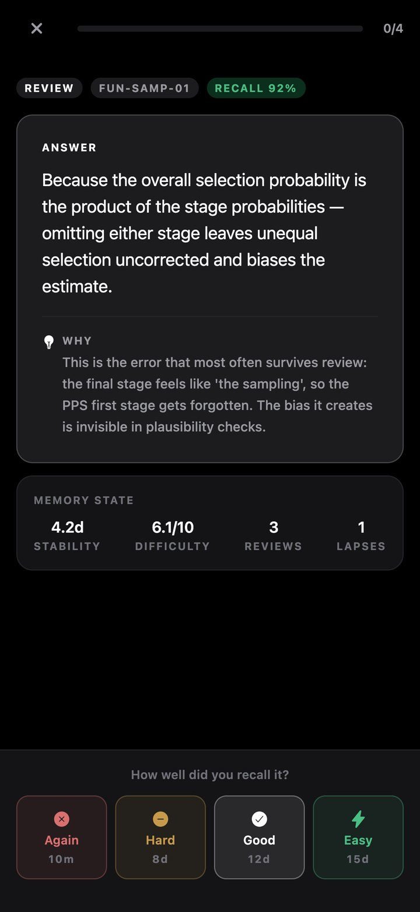</td>
<td>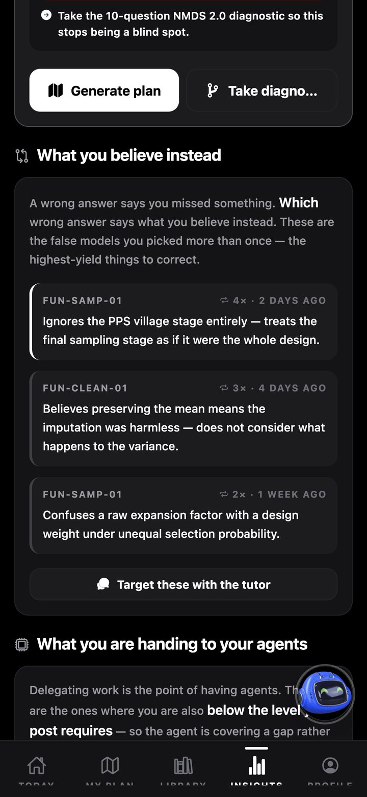</td>
<td>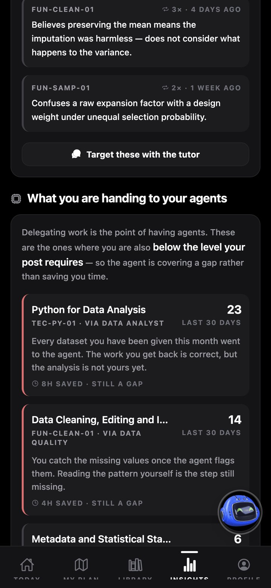</td>
<td>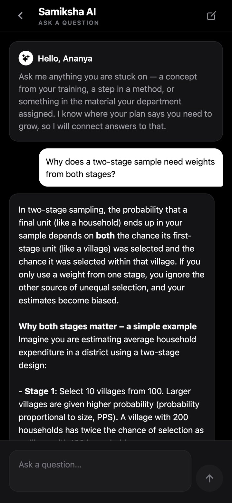</td>
</tr>
<tr>
<td><b>Grounded feedback</b><br/><sub>Confidence before reveal, distractor rationale, "grounded in your material" citation.</sub></td>
<td><b>Spaced review</b><br/><sub>FSRS-6 memory state and the real next interval for every grade.</sub></td>
<td><b>What you believe instead</b><br/><sub>Recurring misconceptions from which wrong answer was chosen.</sub></td>
<td><b>Handing to your agents</b><br/><sub>Delegations joined to measured gaps — "23 Python tasks, still a gap".</sub></td>
<td><b>Samiksha AI</b><br/><sub>A tutor that knows the officer's gaps and assigned material.</sub></td>
</tr>
</table>

### The administrator

<table>
<tr>
<td width="20%"></td>
<td width="20%">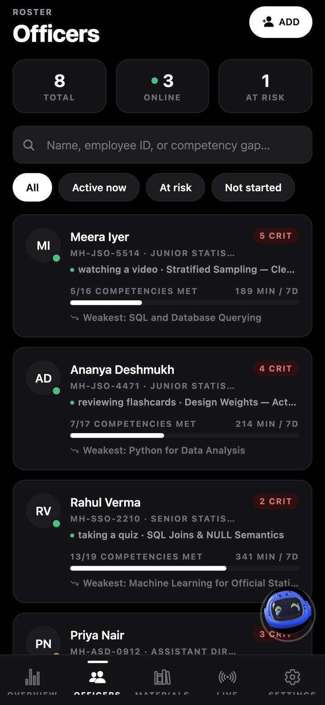</td>
<td width="20%">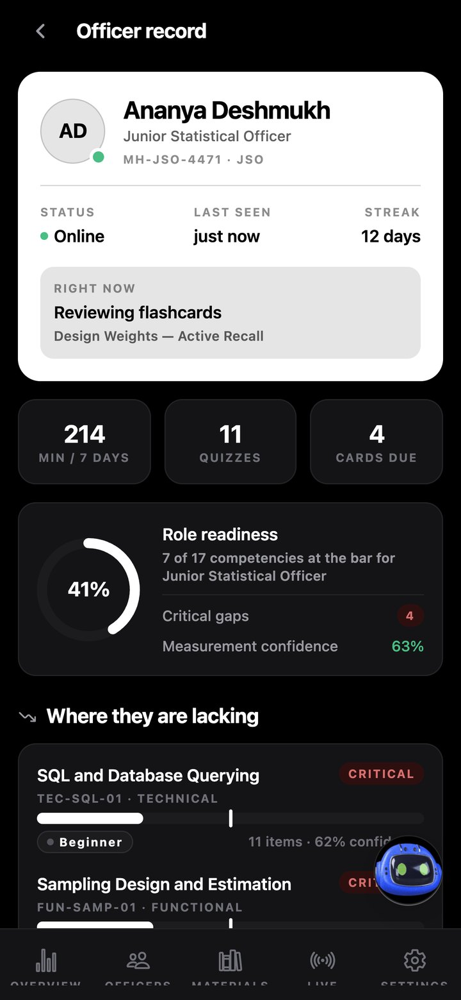</td>
<td width="20%">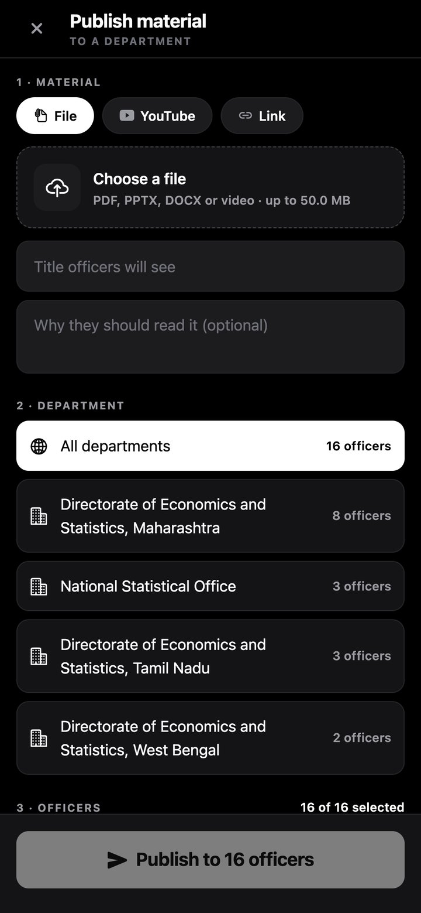</td>
<td width="20%">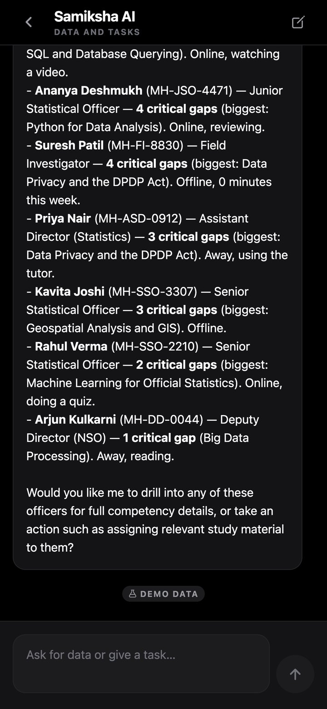</td>
</tr>
<tr>
<td><b>Workforce Intelligence</b><br/><sub>Where the workforce is weak, how many officials are below the bar, quarterly trend. Aggregate by construction.</sub></td>
<td><b>Roster</b><br/><sub>Presence first; filters for active, at risk, not started.</sub></td>
<td><b>Officer record</b><br/><sub>Are they using it, where are they weak, why, and what next.</sub></td>
<td><b>Publish</b><br/><sub>File or link → department → officers, with open rates.</sub></td>
<td><b>Operator AI</b><br/><sub>Live data on request; actions come back as cards to confirm.</sub></td>
</tr>
</table>

### The AI Workspace

Officers sign in with the same credentials the administrator issued for the phone. Three agents are provisioned at first sign-in — no setup:

| Agent | Competencies it is evidence about | Does | Never |
|---|---|---|---|
| **Data Quality** | `FUN-CLEAN-01` `FUN-QUAL-01` | Missing-data patterns (MCAR/MAR/MNAR), duplicates, units, implausible values, broken joins | Silently repairs data |
| **Data Analyst** | `TEC-PY-01` `FUN-ANAL-01` `FUN-SAMP-01` `TEC-SQL-01` | Applies design weights, computes indicators and tables, flags material movements | Assumes simple random sampling |
| **Report Assistant** | `FUN-META-01` `FUN-DISS-01` `BEH-COM-01` | Drafts against approved templates with every figure traceable | Invents a figure or sends anything onward |

Before every run the officer's post, gaps and strengths are read from Supabase and placed in the agent's system prompt; after every run an `agent_delegations` row is written. `v_officer_dependency` joins the two — delegating what you can already do scores zero; delegating what your post needs you to do shows up as a development need.

---

## Features

<details open>
<summary><b>Competency intelligence</b></summary>

- **39 FRAC competencies** across four families — statistical (functional + domain), technical (Python, R, SQL, GIS, ML, BI, APIs, cloud, big data), digital governance (cybersecurity, DPDP Act, e-Sign/e-Office, DPI, open data) and behavioural — mapped to **six posts** from Field Investigator to Director
- Evidence-weighted scores with **measurement confidence**; "no data" is never treated as "weak"
- **Deterministic gap analysis** in SQL, weighted by importance and criticality, damped by confidence
- **Prerequisite graph** returning the learnable frontier, not just the biggest gap
- **Adaptive diagnostic** (2PL IRT) reaching a reliable measurement in about half the questions
- **Misconception tracking** from which distractor was chosen
- **AI diagnosis** that interprets the numbers, never invents them
</details>

<details open>
<summary><b>Learning</b></summary>

- **Personalised learning path** over iGOT Karmayogi / NSSTA courses, curated videos, quizzes, decks, practice and reflection — spaced, interleaved, retrieval after every input, prerequisite-ordered
- **Material ingestion** for PDF, PPTX (with speaker notes), DOCX, text, images (OCR), video and YouTube/web links; page-aware chunking and embeddings
- **Grounded MCQ generation** — strict JSON schema, verbatim source quote verified in the document, page/slide citation, Bloom and difficulty spread, misconception-tagged distractors
- **Practice from any assigned material** — quiz (6), flashcards (10), timed mock test (15) — with the grounding source disclosed
- **FSRS-6 spaced repetition** with target retention and interleaved due queue
- **Confidence calibration** captured before every answer is revealed
- **AI tutor** with retrieval over the officer's own material and citations
- **Curated videos** ranked by AI for teaching quality, played through the official embedded player
- Daily goal, streaks, XP and achievements
</details>

<details open>
<summary><b>Administration</b></summary>

- Account provisioning against employee IDs — create, reset password, deactivate, reactivate (no self-registration)
- Workforce Intelligence: competency health by family, competency and office; officials below the bar; trends; training demand
- Officer roster and records: presence, engagement, gaps, misconceptions, next step
- Live board with heartbeat presence and realtime activity stream
- Publish study material (≤ 50 MB files or links) to all departments, one department or named officers; open tracking
- Samiksha AI operator: 6 read tools and 5 confirm-before-act action tools
</details>

<details open>
<summary><b>Platform</b></summary>

- Four Android variants and a Windows installer from one release pipeline
- Offline demo mode for both journeys; demo AI calls never touch the database and are rate-limited
- Monochrome light and dark themes, physics-based motion, a context-aware floating mascot
- The same app runs in a browser
- One-command bring-up for the whole stack
</details>

---

## Architecture

```
┌────────────────────────────────┐        ┌────────────────────────────────────┐
│  SAMIKSHA MOBILE APP            │        │  SAMIKSHA WORKSPACE                 │
│  React Native 0.86 · Expo 57    │        │  Electron · React 19 · API · worker │
│  Officer · Admin · Demo variants│        │  Sandbox supervisor · PostgreSQL    │
│  Ships only the public anon key │        │  Agent computers in Docker          │
└───────────────┬────────────────┘        └───────┬───────────────────┬────────┘
                │ JWT · RLS · functions         verify sign-in        │ agent runs
                │                              read gaps · write      │
┌───────────────▼──────────────────────────────── delegations ─────┐  │
│  SUPABASE — single source of truth                               │  │
│  Auth · Storage · Realtime │ Postgres + pgvector  │ Edge Functions│  │
│  provisioned accounts      │ 42 tables · 75 RLS   │ assistant     │  │
│  private materials bucket  │ gap · ZPD · IRT SQL  │ study · tutor │  │
│  presence push             │ Vault secrets        │ quiz · path … │  │
└─────────────┬───────────────────────┬───────────────────┬────────┘  │
              │                       │                   │           │
     ┌────────▼───────┐     ┌─────────▼────────┐   ┌──────▼───────────▼──────┐
     │ YouTube Data   │     │ iGOT Karmayogi   │   │ Samiksha AI engine      │
     │ API (metadata) │     │ simulator ⇄ live │   │ DeepSeek V4 Flash       │
     └────────────────┘     └──────────────────┘   │ OpenRouter · or on-prem │
                                                   └─────────────────────────┘
```

| Layer | Stack |
|---|---|
| **Mobile** | React Native 0.86 (new architecture), Expo SDK 57, React 19.2, TypeScript, expo-router, TanStack Query, Zustand, Reanimated 4, react-native-svg |
| **Backend** | Supabase — PostgreSQL, pgvector, Row Level Security, Auth, Storage, Realtime, Vault, Deno Edge Functions |
| **AI** | DeepSeek V4 Flash via OpenRouter; built-in `gte-small` embeddings; local inference via Ollama |
| **Workspace** | Node.js + TypeScript, Hono API, React 19 + Vite + Tailwind, Electron, PostgreSQL + Prisma, Better Auth, Docker sandboxes, Turborepo |
| **Delivery** | GitHub Actions release pipeline, Docker Compose, one-command start script |

### Server functions

| Function | Purpose |
|---|---|
| `assistant` | Samiksha AI — learner tutor, or administrator operator with confirm-before-act tools |
| `study` | Quiz, flashcards or mock test from assigned material (hedged parallel batches) |
| `process-material` | Upload → extract → page-aware chunk → embed → AI analysis |
| `generate-quiz` | Grounded, page-cited, Bloom-spread MCQs |
| `generate-flashcards` | Atomic retrieval cards with elaborations for FSRS |
| `diagnose-competency` | SQL gap recomputation + AI interpretation |
| `generate-path` | Gaps + readiness + iGOT courses → sequenced plan with reasons |
| `tutor` | Retrieval-augmented tutor with citations |
| `curate-videos` | YouTube Data API search + AI quality assessment |
| `admin-users` | Account provisioning, verified admin role |

---

## AI design and model choice

**One pinned model powers every AI feature: DeepSeek V4 Flash.** Officers only ever see "Samiksha AI" — model names never appear in the interface.

| Why | What it means here |
|---|---|
| **Open weights — easy to fine-tune** | Can be adapted with LoRA / QLoRA on MoSPI and NSSTA manuals, SQAF, NMDS and trainer-approved questions. A closed, API-only model cannot be adapted or pinned the same way. |
| **Sovereign hosting** | Base or fine-tuned, it can run inside government infrastructure (NIC / MeghRaj) so officer data stays in India — relevant under the DPDP Act, 2023. |
| **Efficient "Flash" design** | Mixture-of-experts: fast, inexpensive inference and cheap adapter training. |
| **Very long context** | A whole 150-page handbook in one call — no chunk-stitching, no contradictory questions across chunks. |
| **Cost at workforce scale** | ≈ US$0.09 per million input tokens: a 20-question quiz from a full PDF costs well under a cent. |
| **Strict JSON & tool calling** | Response shape is guaranteed; tools power the administrator operator. |
| **No lock-in** | One gateway, one environment variable; a local model path is already proven. |

**The fine-tuning dataset is a by-product of running the platform:** every AI call is audited in `ai_generations`; questions carry verified source quotes, grounding flags and observed difficulty; distractors carry misconception rationales; trainer edits become preference data. Plan: LoRA on the public statistical corpus → supervised fine-tuning on approved content → preference tuning → evaluate against the grounding rate and calibrated difficulty the pipeline already measures → deploy on government infrastructure behind the same gateway.

**Safety regardless of model:** deterministic maths first · strict schemas · mechanical grounding checks · disclosed sources · retries, timeouts and hedged calls · full audit · agents draft, people decide.

---

## Algorithms and learning science

**Gap and priority** — computed in SQL, explained by AI:

```
priority = max(0, required − score) × weight × (critical ? 1.5 : 1) × (0.5 + 0.5 · confidence)
confidence = (n + 1) / ((n + 1) + 8)
```

**Prerequisite readiness** — `rank = priority × (0.25 + 0.75 · readiness)`.

**Adaptive testing (2PL IRT)** — `P = 1 / (1 + e^(−a(θ − b)))`, information `a²P(1 − P)`, maximum-information item selection, Newton–Raphson update, precision-based stop. Identical maths in TypeScript and SQL.

**FSRS-6 spaced repetition** — stability, difficulty, retrievability; verified interval-for-interval against the reference implementation:

| Sequence | Intervals | |
|---|---|---|
| all Good | 10m → 2d → 11d → 46d → 163d → 498d → 1348d → 3299d | ✅ identical |
| all Easy | 8d → 66d → 397d → 1875d → 7265d | ✅ identical |
| Good ×3 → Again → Good | 10m → 2d → 11d → 10m → 2d → 5d | ✅ identical |

| Method | Where it lives |
|---|---|
| Spaced repetition | FSRS-6 scheduling; plans revisit topics across weeks |
| Retrieval practice | A retrieval step after every input step; practice from every material |
| Interleaving | Due cards rotate competencies; plans alternate related gaps |
| Elaborative interrogation | Every flashcard carries a "why" elaboration |
| Metacognitive calibration | Confidence before reveal; calibration error and overconfidence reported |
| Bloom's taxonomy | Generated quizzes target Apply / Analyse / Evaluate |
| Zone of proximal development | Prerequisite graph with readiness |

---

## Security and governance

- **The APK ships only the public Supabase URL and anon key.** Row Level Security is the real boundary.
- `scripts/sync-env.mjs` **refuses to sync** if a server secret ever carries an `EXPO_PUBLIC_` prefix.
- Server secrets live in Edge Function secrets or **Supabase Vault**, readable only by the service role.
- **All 42 tables are deny-by-default** with 75 explicit policies; `auth.uid()` evaluated once per statement; function execute revoked from anonymous users.
- **No self-registration** — administrators provision every account against a verified employee ID; the Workspace verifies the same credentials against Supabase on every sign-in (`SIGNUPS_ENABLED=false`).
- Workforce views are **aggregate by construction**.
- **Agents draft, people decide** — no agent instruction ends in sending, publishing or silently correcting a figure; administrator AI actions require confirmation.
- Every AI call is audited; demo traffic is isolated and rate-limited; videos play only through the official embedded player.

---

## Getting started

### Install the apps

1. Open the [latest release](https://github.com/adryxportfolio/sih2026/releases/latest) on an Android phone (7.0+).
2. Download **Samiksha-Officer-Demo** or **Samiksha-Admin-Demo** to explore without an account, or **Samiksha-Officer** / **Samiksha-Admin** to sign in.
3. Allow *Install unknown apps* for your browser, then install. All variants can be installed side by side.
4. On Windows, run **Samiksha-Workspace-Setup** for the desktop AI Workspace.

### Run the whole stack — one command

```bash
node scripts/start.mjs
```

It finds this machine's LAN address and writes it everywhere it must agree, generates missing secrets, checks the model server, and brings the stack up in Docker. Safe to re-run. Add `--native` to run services directly.

**Prerequisites:** Docker Desktop (WSL2 backend, 8 GB+), Node 22.22+ / 24+ / 26+, pnpm 9+, and an OpenRouter key in `workspace/.env`. Phone and PC must share a network — a phone hotspot is more reliable than venue Wi-Fi.

```bash
# workspace/.env
PI_DEFAULT_PROVIDER=openrouter
PI_DEFAULT_MODEL=deepseek/deepseek-v4-flash
OPENROUTER_API_KEY=sk-or-...
```

### Mobile development

```bash
cd mobile
pnpm install
pnpm web        # browser preview
pnpm android    # USB phone, developer mode on
```

### Backend

1. Run `supabase/schema.sql` (all migrations, in order) in the SQL editor.
2. Create a private storage bucket named `materials`.
3. Store the model key as the function secret `OPENROUTER_API_KEY` or in Vault as `openrouter_api_key`.
4. Deploy the Edge Functions: `supabase functions deploy`.

The app runs in demo mode without any of this. Detailed runbooks: [Windows setup](docs/windows-setup.md) · [Workspace demo setup](docs/workspace-demo-setup.md).

### Checks

```bash
cd mobile && pnpm typecheck      # clean
cd workspace && pnpm check       # 20 passing
```

---

## Repository layout

```
mobile/                      Expo / React Native app — four variants from one codebase
  app/                       screens: (tabs) officer · (admin) administrator · assessment,
                             quiz, review, practice, assistant, tutor, workspace, publish …
  src/lib/                   fsrs.ts · irt.ts · api.ts · study.ts · assistant.ts · demo.ts
  src/components/            UI kit · SVG charts · motion kit · floating mascot
  src/theme/                 monochrome design tokens
supabase/
  migrations/                15 ordered migrations
  schema.sql                 all migrations bundled, paste-ready
  functions/                 10 Edge Functions + shared gateway, schemas, iGOT adapter
workspace/                   AI Workspace — apps/api · web · worker · desktop, infra, packages
scripts/                     start.mjs (one-command bring-up) · sync-env.mjs (secret guard)
.github/workflows/           release pipeline — four APKs + Windows installer
docs/                        documentation PDF · presentation · runbooks · screenshots
```

---

## What has been built, and why

| Milestone | Why |
|---|---|
| Schema, RLS and AI functions first | Security and the competency model underpin every later feature |
| Monochrome design system and mascot | A calm, legible daily tool; help that is contextual rather than hidden |
| Prerequisite graph and misconceptions | "Biggest gap first" recommends unlearnable things; a score can't say what someone believes |
| Technical and digital-governance competencies, PPTX/DOCX, iGOT contract | A line-by-line reading of SIH26101 required them |
| Single open-weight model and hardening | Predictable cost, a fine-tuning and sovereignty path, smaller attack surface |
| Administrator app, adaptive test, presence, provisioning | The Ministry's questions are aggregate; measurement must be short enough to finish; no self-registration in government |
| AI Workspace on Samiksha identity | Capacity building should also raise productivity |
| The competency loop | Joining learning and doing is what separates this from a quiz generator with a chatbot |
| One-command start and release pipeline | Evaluators install and run the product directly |
| Department material, Samiksha AI, AI practice | Every assigned handbook should become practice; administrators need answers and actions |

---

## Limitations and roadmap

Stated plainly:

- **iGOT Karmayogi runs on a simulator built on the real API contract** — including course eligibility rules. Production credentials need an institutional arrangement; one variable (`IGOT_MODE=live`) switches it.
- **FRAC mappings are a reconstruction** from published MoSPI, NSSTA, SQAF and NMDS 2.0 material; the authoritative dictionary is internal to DoPT. Mappings are data, not code.
- **The base model is not yet fine-tuned** — the data to do it is being collected.
- **FSRS uses population weights** until enough reviews exist; IRT discrimination is held constant until response volume allows per-item estimation.
- **Agent computers need Docker** on the host.
- **The interface is English**; Hindi and regional languages are next.

**Roadmap:** state DES pilot with live iGOT → fine-tuned model on government infrastructure, languages and offline sync → Karmayogi competency passbook sync, training-impact evaluation and department agent templates (CPI, ASI, PLFS).

---

<div align="center">
<sub>Built for Smart India Hackathon 2026 · Problem Statement SIH26101 · Ministry of Statistics & Programme Implementation</sub><br/>
<sub><i>The measure of success is not how much work the AI does, but how much more capable each officer becomes.</i></sub>
</div>
