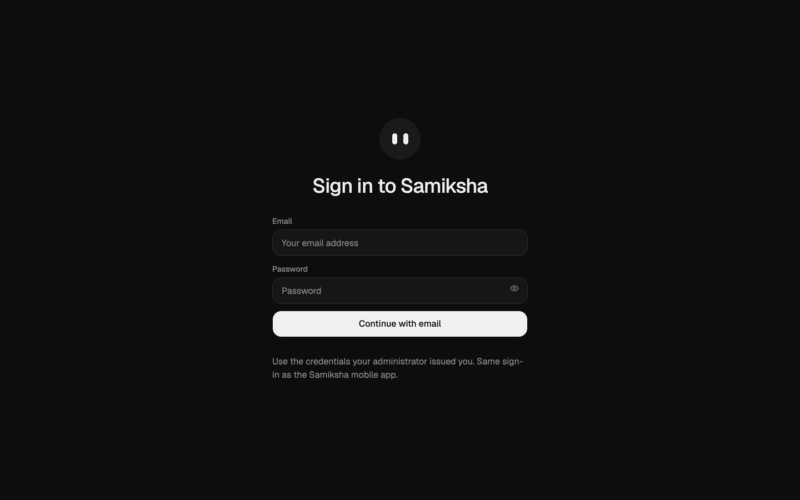

# Samiksha Workspace

The AI agent workspace of [Samiksha](../README.md), the capacity-building platform for India's
Official Statistical System (SIH26101).

The mobile app measures where each officer falls short of their post and teaches what is missing.
The Workspace gives them AI agents for the repetitive analytical work — and joins the two: agents
are told where the officer is weak and explain the step that matters, and every delegation is
recorded against a competency.



## What it does

- **Persistent agents** with their own conversations, memory, routines and history
- **Agent computers** — isolated Linux containers with a browser, terminal, files and a graphical desktop
- **Three starter agents** provisioned at first sign-in, each mapped to FRAC competencies:
  - **Data Quality** — missing-data patterns, duplicates, units, implausible values; proposes fixes, never repairs silently
  - **Data Analyst** — applies design weights, computes indicators and summary tables; asks before assuming simple random sampling
  - **Report Assistant** — drafts against approved templates with every figure traceable; never sends anything onward
- **One identity** — officers sign in with the credentials an administrator issued in the Samiksha
  mobile app. Every sign-in is verified against Supabase and self-registration is closed
  (`SIGNUPS_ENABLED=false`)
- **Competency-aware runs** — the officer's post, gaps and strengths are placed in each agent's
  system prompt (`packages/adapters/src/competency.ts`)
- **Delegation as evidence** — each completed run writes an `agent_delegations` row that the mobile
  app shows as *"What you are handing to your agents"*
- **Agents draft, people decide** — no agent instruction ends in sending, publishing or silently
  correcting a figure
- Voice dictation through the browser's built-in speech recognition
- Windows desktop installer; also opens inside the Samiksha phone app from the mascot

## Stack

- TypeScript, Node.js
- React 19, Vite and Tailwind CSS (web)
- Electron (desktop)
- Hono API, background job worker
- PostgreSQL and Prisma
- Better Auth, bridged to Supabase identity
- Docker sandbox supervisor for agent computers
- DeepSeek V4 Flash via OpenRouter, or a local model

## Run it

From the repository root, one command brings the whole stack up:

```bash
node scripts/start.mjs
```

It resolves this machine's LAN address and writes it into every file that must agree about it,
generates missing secrets, checks the model server and starts the services in Docker. Add
`--native` to run the services on the host (agent computers still need Docker).

**Prerequisites:** Docker Desktop (WSL2 backend, 8 GB+), Node.js 22.22+ / 24+ / 26+, pnpm 9+.

### Configuration (`workspace/.env`)

```bash
# AI engine
PI_DEFAULT_PROVIDER=openrouter
PI_DEFAULT_MODEL=deepseek/deepseek-v4-flash
OPENROUTER_API_KEY=sk-or-...

# Identity bridge and competency loop
SIGNUPS_ENABLED=false
SUPABASE_URL=https://<project>.supabase.co
SUPABASE_ANON_KEY=...
SUPABASE_SERVICE_ROLE_KEY=...

# Agent computer limits — must not be blank
SAMIKSHA_COMPUTER_MEMORY=2g
SAMIKSHA_COMPUTER_CPUS=2
SAMIKSHA_COMPUTER_PIDS_LIMIT=512
```

For on-premises or offline inference use `PI_DEFAULT_PROVIDER=local` with
`SAMIKSHA_LOCAL_MODELS=qwen3:1.7b`.

### Manual development

```bash
cd workspace
pnpm install
pnpm db:generate
pnpm db:migrate
pnpm sandbox:build     # large image — build it ahead of time
pnpm dev               # web :5173 · api :3100 · worker · supervisor :7091
```

Desktop shell: `pnpm --filter @samiksha/desktop dev`.

Full runbooks: [Workspace demo setup](../docs/workspace-demo-setup.md) ·
[Windows setup](../docs/windows-setup.md).

## Layout

```text
apps/api        HTTP/RPC API, authentication, agents and spaces
apps/web        web client
apps/worker     agent runs, routines, notifications
apps/desktop    Electron shell and Windows installer
packages/       contracts, core, db (Prisma), adapters, auth, memory, UI, test kit
infra/          Docker Compose, agent computer image, sandbox supervisor
docs/           operations guides
```

Samiksha-specific integration points:

| File | Role |
|---|---|
| `packages/auth/src/supabase-identity.ts` | Verifies credentials against Supabase and reconciles the local user |
| `packages/adapters/src/competency.ts` | Loads the officer's competency profile and records delegations |
| `packages/adapters/src/executor.ts` | Adds competency context to every run |
| `packages/db/src/default-agents.ts` | The three starter agents and their competency mappings |

## Checks

```bash
pnpm check    # expect 20 passing
pnpm lint
pnpm test
```

## Troubleshooting

| Symptom | Fix |
|---|---|
| Local model running but agents never reply | Containers cannot reach the host's `127.0.0.1`; use `host.docker.internal` (the start script does) |
| Sandbox supervisor does not start | `SAMIKSHA_COMPUTER_MEMORY` is blank — blank means invalid, not unlimited |
| Phone loads the page, then sign-in fails with CORS | `BETTER_AUTH_URL` / `WEB_ORIGIN` must use the LAN address, not loopback |
| Container fails with `bad interpreter` | CRLF endings in `infra/sandboxes/computer/start.sh`; keep it LF |
| `ENAMETOOLONG` on Windows | Clone to a short path such as `C:\dev\sih2026` |

Licensed under the [Apache License 2.0](./LICENSE).
